```mermaid
graph LR
    %% Node Definitions
    A("Raw FHV Trip Data")
    B("Data Lake (Delta)")
    C("Data Cleaning & Feature Engineering")
    D("Model Training (ML)")
    E("Predictions & Evaluation")
    F("Power BI Dashboards")

    %% Links (Single-Row Horizontal Flow)
    A --> B
    B --> C
    C --> D
    D --> E
    E --> F

    %% Styling
    style A fill:#FF9999,stroke:#333,stroke-width:2px,color:#000;
    style B fill:#99FF99,stroke:#333,stroke-width:2px,color:#000;
    style C fill:#9999FF,stroke:#333,stroke-width:2px,color:#000;
    style D fill:#FFFF99,stroke:#333,stroke-width:2px,color:#000;
    style E fill:#FFCC99,stroke:#333,stroke-width:2px,color:#000;
    style F fill:#CC99FF,stroke:#333,stroke-width:2px,color:#000;

```

[]()
[]()
[]()
[]()
[]()


# 🚖 NYC FHV Base Fare Prediction

> Predict NYC taxi fares with **up to 89% accuracy** using state-of-the-art ML pipelines and interactive dashboards.  
> Built with **Microsoft Fabric, Spark, Delta, LightGBM**, and Power BI for real-world impact.

[]()  
[]()  
[]()

---

## 🎯 Project Overview

NYC’s FHV (High-Volume For Hire Vehicle) industry handles **millions of trips every month**. Operators, regulators, and riders need:

- **Fair & transparent pricing**  
- **Accurate revenue forecasts**  
- **Fraud detection & anomaly monitoring**

This project demonstrates an **end-to-end ML pipeline**:

1. Clean & explore **2M NYC FHV trips**  
2. Engineer **77 predictive features**  
3. Train & evaluate **multiple ML models**  
4. Predict fares for **20M unseen trips**  
5. Integrate results into **interactive Power BI dashboards**  

#### 🔄 Pipeline Overview


---

## 📂 Dataset

| Dataset        | Size        | Key Features |
|----------------|------------|--------------|
| NYC TLC high volume FHV Trip Records | ~20M trips | Access monthly datasets (e.g., June 2025) in Parquet format directly from the NYC Taxi and Limousine Commission. These datasets are ideal for large-scale analysis. 🔗 [NYC TLC High Volume FHV Trip Records](https://www.nyc.gov/site/tlc/about/tlc-trip-record-data.page?utm_source=chatgpt.com) |
| Training                             | ~2M trips  | from June 2025 trips, Base fare, trip miles & time, surcharges, tips, driver pay, flags (airport/shared/WAV), temporal markers |
| Predictions                          | ~20M trips | from July 2025 trips, Same fields for forecasting |

📄 [Full Data Dictionary](docs/data_dictionary_trip_records_hvfhs.pdf)

---

## 📊 EDA & Feature Engineering

- **Base fares:** $12–$34, right-skewed  
- **Trip miles:** many short trips, long-tail effects  
- **Surcharges & tolls:** mostly zero, but key predictors  
- **Tips:** mostly zero, heavy-tail for some trips  

✅ **Feature Engineering Highlights:**  

- 77 features derived, including temporal, flag, and log-transformed variables  
- Scaling & normalization applied for model stability  
- Created interpretable features for regulatory use  

#### Before vs After Transformation


---

## 🤖 Models & Leaderboard

| Model                        | R²    | RMSE  | MAE   |
|-------------------------------|-------|-------|-------|
| Linear Regression (baseline)  | 0.740 | 0.33  | 0.25  |
| XGBoost                       | 0.869 | 0.24  | 0.17  |
| CatBoost                      | 0.870 | 0.24  | 0.17  |
| Neural Net (basic MLP)        | 0.862 | 0.24  | 0.18  |
| Neural Net (stronger MLP)     | 0.867 | 0.238 | 0.173 |
| **LightGBM (best)**           | **0.888** | **0.22** | **0.16** |

#### Top Features (LightGBM)

1. Base calculated fare  
2. Trip miles & trip time  
3. Driver pay  
4. Surcharges & airport flag  


---

## 🔮 Predictions & Business Impact

- **Predicted 20M unseen trips** with R² ≈ 0.87  
- **Power BI dashboards** enable real-time fare monitoring, scenario analysis, and fraud detection  

#### Predicted vs Actuals


#### Business Benefits

| Goal                     | Impact |
|---------------------------|--------|
| Revenue Forecasting       | Near real-time, high-scale predictions (~20M trips/month) |
| Pricing Strategy          | Evidence-based surcharge & airport trip evaluation |
| Regulatory Transparency   | Linear Regression baseline ensures interpretability |
| Fraud Detection           | Outlier predictions highlight anomalies |

---

## 🖼 Visual Story (Top 6 Highlights)

1. **Fare distribution**  
     
2. **Scatterplots: fare vs miles & time**  
     
3. **Leaderboard: model comparison**  
     
4. **LightGBM feature importance**  
     
5. **Predicted vs actual fares**  
     
6. **Power BI Dashboard snapshot**  
     

---

## ☁️ Microsoft Fabric: Powering the Pipeline

This project leverages **Microsoft Fabric** to build a **scalable, end-to-end machine learning pipeline** for NYC FHV fare prediction. Fabric combines **data engineering, lakehouse storage, and real-time analytics** in a unified platform.

### 🔹 Key Features Leveraged

- **Spark Pools**: Efficiently process **millions of FHV trips** with distributed computing.  
- **Delta Lake**: Ensure **reliable, ACID-compliant storage** and seamless incremental updates.  
- **Dataflow & Pipelines**: Automate **ETL workflows**, including feature engineering and preprocessing.  
- **Machine Learning Integration**: Train **LightGBM, XGBoost, and Neural Networks** directly within Fabric.  
- **Power BI Integration**: Real-time dashboards for **business insights, scenario analysis, and anomaly detection**.  

### 🔹 Workflow Overview



---

## ⚙️ Getting Started

```bash
git clone https://github.com/<your-username>/nyc-fhv-base-fare-prediction.git
cd nyc-fhv-base-fare-prediction
```
> Optional: Use [sample data](/sample_data/) to explore without full dataset.

---

## 📖 Documentation

* [Detailed Presentation](/docs/PRESENTATION.md)
* [Executive Summary (1-pager)](/docs/EXEC_1PAGER.md)
* [Data Dictionary](/docs/data_dictionary_trip_records_hvfhs.pdf)
* [Notebooks](/notebooks/)
* [Power BI Reports](/powerbi/)

---

## 📄 License

MIT License. See [LICENSE](LICENSE).


pip install -r requirements.txt
jupyter lab
