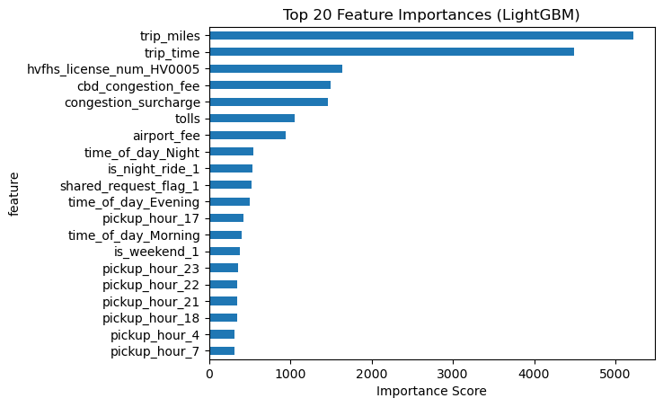

Perfect 🚀 — here’s your **refreshed README.md** with the critical dataset detail (2M June 2025 trips for training and 20M July 2025 trips for predictions) patched in.

---

# 🚖 NYC FHV Base Fare Prediction

> An end-to-end machine learning pipeline to predict **base passenger taxi fares** in New York City’s High-Volume For Hire Vehicle (FHV) services.
> Built on **Microsoft Fabric** with Spark, Delta, and modern ML frameworks.

---

## 📑 Table of Contents

1. [Project Overview](#-project-overview)
2. [Dataset](#-dataset)
3. [Exploratory Data Analysis](#-exploratory-data-analysis)
4. [Feature Engineering](#-feature-engineering)
5. [Models & Results](#-models--results)
6. [Best Model: LightGBM](#-best-model-lightgbm)
7. [Predictions on New Data](#-predictions-on-new-data)
8. [Business Impact](#-business-impact)
9. [Visual Story](#-visual-story)
10. [Getting Started](#-getting-started)
11. [License](#-license)

---

## 🎯 Project Overview

NYC’s FHV industry generates millions of trips every month. Regulators, operators, and riders all need:

* **Pricing transparency** (fair and consistent fares)
* **Revenue forecasting** (for planning & operations)
* **Regulatory compliance** (accurate reporting)
* **Fraud detection** (flagging unusual trips)

This repo demonstrates how to:

* Explore and prepare **NYC FHV trip data**
* Build and evaluate multiple ML models
* Deliver accurate fare predictions (**up to 89% accuracy**)
* Integrate results into **Power BI dashboards** for decision-making

📊 *[Insert pipeline diagram here]*

---

## 📂 Dataset

* **Training Data**: ~2M FHV trips sampled from **June 2025**
* **Predictions Data**: ~20M unseen FHV trips from **July 2025**
* **Key fields**:

  * Base fare (target)
  * Trip miles & trip time
  * Surcharges, tolls, tips
  * Driver pay
  * Flags: airport, shared, WAV, access-a-ride
  * Temporal markers: hour-of-day, day-of-week, weekend


---

## 📊 Exploratory Data Analysis

* Base fares: right-skewed, typical range $12–$34
* Trip miles: short trips dominate, long tail inflates averages
* Surcharges & tolls: mostly zero, but key predictors of fare
* Tips: majority zero, but heavy long-tail for some riders

#### 📈 *Distribution: base fares Univariate*


#### 📉 *Bivariate: Scatterplots of fares*


#### 📉 *Bivariate: Boxplots of fares*


---

## 🛠 Feature Engineering

* Derived **77 features** including trip flags, surcharges, and temporal dummies
* Applied **log-transforms + scaling** to normalize skewed variables
* Created interpretable features for regulators (airport flag, shared trips, WAV)

#### 📊 *boxplot: before vs after transformation*


---

## 🤖 Models & Results

We compared a baseline regression model against advanced ML models.

| Model                        | R²        | RMSE     | MAE      |
| ---------------------------- | --------- | -------- | -------- |
| Linear Regression (baseline) | 0.740     | 0.33     | 0.25     |
| XGBoost                      | 0.869     | 0.24     | 0.17     |
| CatBoost                     | 0.870     | 0.24     | 0.17     |
| Neural Net (basic MLP)       | 0.862     | 0.24     | 0.18     |
| Neural Net (stronger MLP)    | 0.867     | 0.238    | 0.173    |
| **LightGBM (best)**          | **0.888** | **0.22** | **0.16** |

---

## 🌳 Best Model: LightGBM

* **Accuracy**: R² = 0.888, RMSE = 0.22, MAE = 0.16
* **Top predictors**:

  1. Base calculated fare
  2. Trip miles & trip time
  3. Driver pay
  4. Surcharges & airport flag

#### 📊 *LightGBM feature importance plot*



---

## 🔮 Predictions on New Data

* Applied the trained LightGBM model to **20M unseen trips from July 2025**
* Maintained **87% accuracy** (R² ≈ 0.87, RMSE ≈ 0.23, MAE ≈ 0.17)
* Predictions closely aligned with actuals
* Integrated into **Power BI dashboards** for:

  * Real-time fare monitoring
  * What-if scenario analysis (e.g., surcharge changes)
  * Fraud detection

#### 📈 *predicted vs actuals*


### 📊 *Power BI dashboard*


---

## 💼 Business Impact

* **Revenue Forecasting**: Near real-time fare predictions at industry scale (~20M trips/month)
* **Pricing Strategy**: Evidence-based evaluation of surcharges & airport trips
* **Regulatory Transparency**: Linear Regression baseline for interpretability
* **Fraud Detection**: Outlier predictions highlight anomalies

📊 *[Insert infographic: Interpretability ↔ Accuracy trade-off]*

---

## 🖼 Visual Story

**Recommended visuals for this repo (6 max):**

#### 1. Fare distribution (EDA)


#### 2. Scatterplot: fare vs miles, trip times... (EDA)


#### 4. Leaderboard bar chart (Model comparison)


#### 5. LightGBM feature importance plot (Best model) 


#### 6. Predicted vs Actual scatterplot (Predictions on 20M July trips)


---

## ⚙️ Getting Started

```bash
git clone https://github.com/<your-username>/nyc-fhv-base-fare-prediction.git
cd nyc-fhv-base-fare-prediction
pip install -r requirements.txt
jupyter lab
```

---

## 📄 License

This project is licensed under the [MIT License](LICENSE).

---

Do you also want me to **refresh the Presentation.md** with this dataset detail (June training vs July predictions), so both documents are fully consistent?
